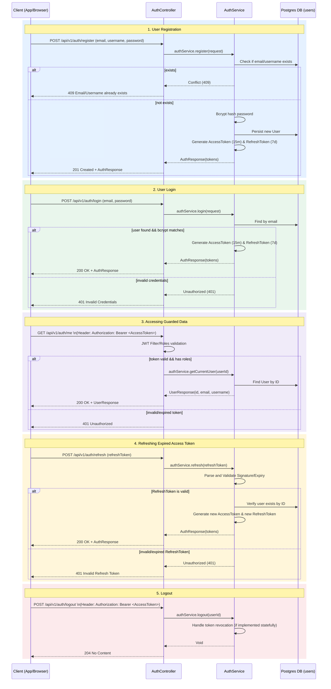

```mermaid
sequenceDiagram
    participant C as Client (App/Browser)
    participant AC as AuthController
    participant AS as AuthService
    participant DB as Postgres DB (users)

    %% Registration Flow
    rect rgba(0, 123, 255, 0.1)
    Note over C, DB: 1. User Registration
    C->>AC: POST /api/v1/auth/register (email, username, password)
    AC->>AS: authService.register(request)
    AS->>DB: Check if email/username exists
    alt exists
        AS-->>AC: Conflict (409)
        AC-->>C: 409 Email/Username already exists
    else not exists
        AS->>AS: Bcrypt hash password
        AS->>DB: Persist new User
        AS->>AS: Generate AccessToken (15m) & RefreshToken (7d)
        AS-->>AC: AuthResponse(tokens)
        AC-->>C: 201 Created + AuthResponse
    end
    end

    %% Login Flow
    rect rgba(40, 167, 69, 0.1)
    Note over C, DB: 2. User Login
    C->>AC: POST /api/v1/auth/login (email, password)
    AC->>AS: authService.login(request)
    AS->>DB: Find by email
    alt user found && bcrypt matches
        AS->>AS: Generate AccessToken (15m) & RefreshToken (7d)
        AS-->>AC: AuthResponse(tokens)
        AC-->>C: 200 OK + AuthResponse
    else invalid credentials
        AS-->>AC: Unauthorized (401)
        AC-->>C: 401 Invalid Credentials
    end
    end

    %% Accessing Secure Endpoints
    rect rgba(111, 66, 193, 0.1)
    Note over C, DB: 3. Accessing Guarded Data
    C->>AC: GET /api/v1/auth/me \n(Header: Authorization: Bearer <AccessToken>)
    AC->>AC: JWT Filter/Roles validation
    alt token valid && has roles
        AC->>AS: authService.getCurrentUser(userId)
        AS->>DB: Find User by ID
        AS-->>AC: UserResponse(id, email, username)
        AC-->>C: 200 OK + UserResponse
    else invalid/expired token
        AC-->>C: 401 Unauthorized
    end
    end

    %% Refresh Token Flow
    rect rgba(255, 193, 7, 0.15)
    Note over C, DB: 4. Refreshing Expired Access Token
    C->>AC: POST /api/v1/auth/refresh (refreshToken)
    AC->>AS: authService.refresh(refreshToken)
    AS->>AS: Parse and Validate Signature/Expiry
    alt RefreshToken is valid
        AS->>DB: Verify user exists by ID
        AS->>AS: Generate new AccessToken & new RefreshToken
        AS-->>AC: AuthResponse(tokens)
        AC-->>C: 200 OK + AuthResponse
    else invalid/expired RefreshToken
        AS-->>AC: Unauthorized (401)
        AC-->>C: 401 Invalid Refresh Token
    end
    end

    %% Logout Flow
    rect rgba(220, 53, 69, 0.1)
    Note over C, DB: 5. Logout
    C->>AC: POST /api/v1/auth/logout \n(Header: Authorization: Bearer <AccessToken>)
    AC->>AS: authService.logout(userId)
    AS->>AS: Handle token revocation (if implemented statefully)
    AS-->>AC: Void
    AC-->>C: 204 No Content
    end
```
